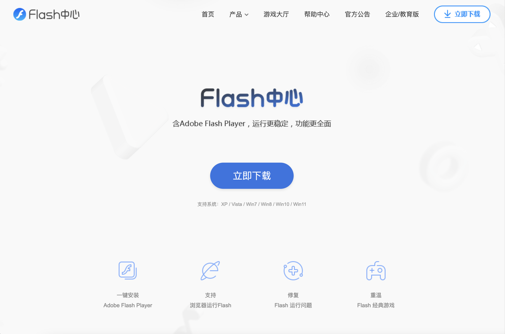
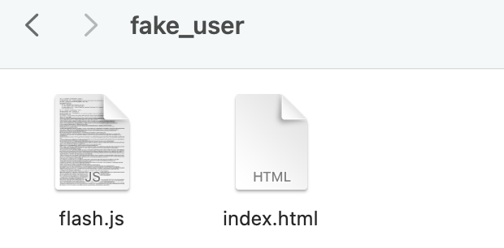
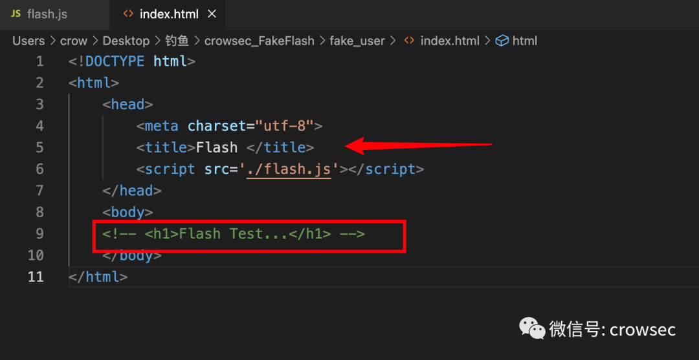
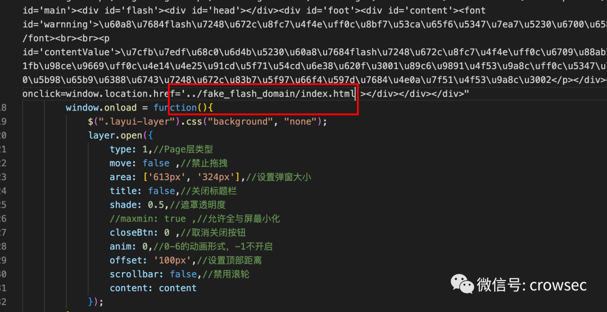
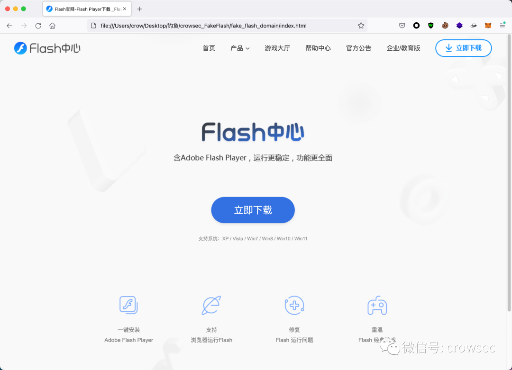
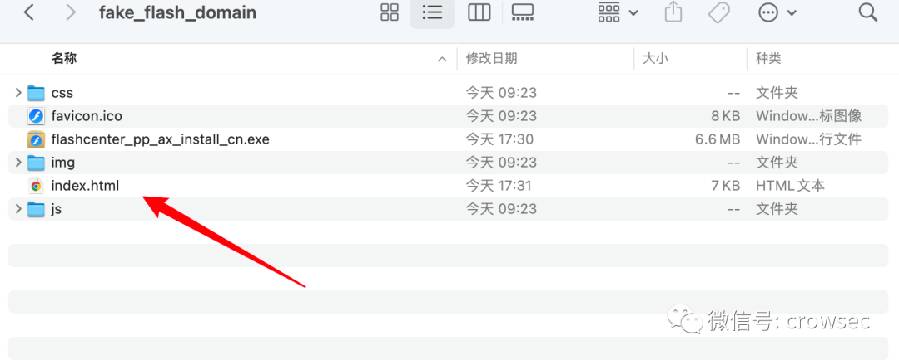
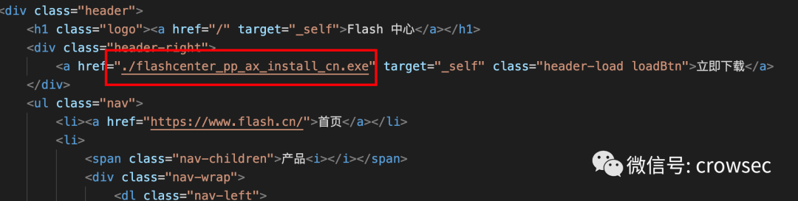
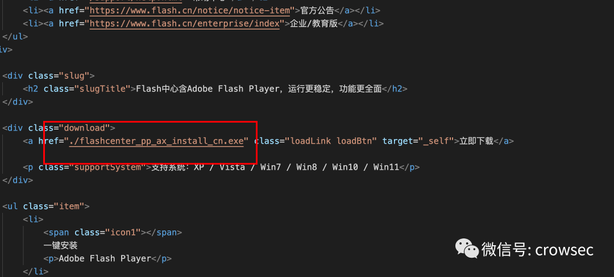
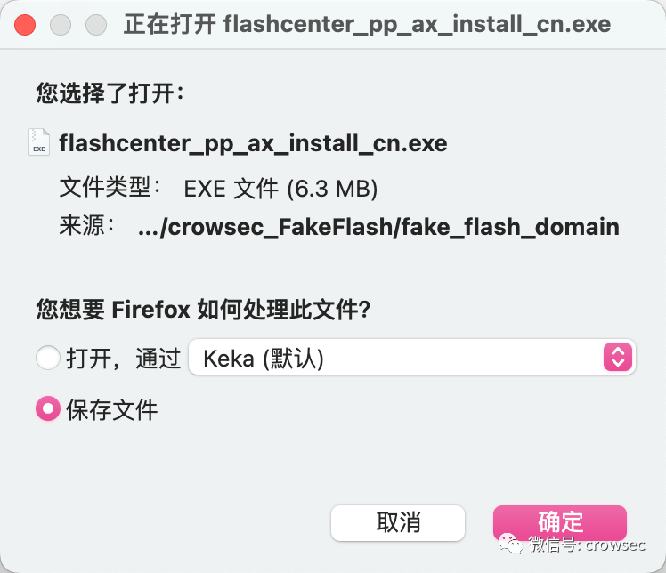

<h1 align="center">crowsec —乌鸦安全</h1>

  
  
  
  
  

# 1. 免责声明

本仓库所提供的技术文章仅供参考，此文所提供的信息只为网络安全人员对自己所负责的网站、服务器等（包括但不限于）进行检测或维护参考，未经授权请勿利用文章中的技术资料对任何计算机系统进行入侵操作。利用此文所提供的信息而造成的直接或间接后果和损失，均由使用者本人负责。

乌鸦安全拥有对此仓库的修改、删除和解释权限，如转载或传播此文章，需保证仓库的完整性，未经授权，不得用于其他。

本仓库所提供的工具仅用于学习，禁止用于其他，请在24小时内删除工具文件！！！

# 2. 工具免责声明

本工具仅面向合法授权的企业安全建设行为，在使用本工具进行检测时，您应确保该行为符合当地的法律法规，并且已经取得了足够的授权。

如您在使用本工具的过程中存在任何非法行为，您需自行承担相应后果，作者将不承担任何法律及连带责任。

在使用本工具前，请您务必审慎阅读、充分理解各条款内容，限制、免责条款或者其他涉及您重大权益的条款可能会以加粗、加下划线等形式提示您重点注意。 除非您已充分阅读、完全理解并接受本协议所有条款，否则，请您不要使用本工具。您的使用行为或者您以其他任何明示或者默示方式表示接受本协议的，即视为您已阅读并同意本协议的约束。

非授权，不渗透，请遵守法律法规！
非授权，不渗透，请遵守法律法规！
非授权，不渗透，请遵守法律法规！
禁止将此工具用于非法活动，否则后果自负！！！
禁止将此工具用于非法活动，否则后果自负！！！
禁止将此工具用于非法活动，否则后果自负！！！

# 3. [FakeFlash](https://github.com/crow821/FakeFlash)

## 2023年新版：flash水坑攻击源码

# 4. 使用说明

2023年`flash`下载界面已经更新了：

在这里我准备好了新的`flash`界面，有两个文件夹：

- • `fake_user`：做水坑用的
- • `fake_flash_domain`：提供下载捆绑木马的

该文件一共包含两个，来源于https://github.com/chroblert/Flash-Pop2

## 4.1 fake_user

在这里需要手动进行配置：

`index.html`是要插入对方需要访问的网页中，进行水坑攻击的，其中

``是关键，在这需要配置你的文件。

而`flash.js`文件中，需要在引入的`js`中加入`https`，在文件尾部写上你的引用要下载木马的地址：

当插入到页面之后，首先就是提示`flash`版本过低：

当点击立即升级的时候会跳转到你的指定页面：

## 4.2 fake_flash_domain

在这里只需要进行一个配置`index.html`

然后全文将两处立即下载的地址替换掉：

此时，点击页面即可下载你的exe文件：

# 5. 总结

本文只是对`flash`的钓鱼页面进行了更新，没有考虑诸如管理员下载安装之后，自动收杆的操作，也没有考虑免杀等操作，思路其实是很开阔的。
**非授权，不渗透，请遵守法律法规！**

# starred

 

# License

Copyright © 2023 [crow821](https://github.com/crow821)

本项目遵循协议：[GPL--3.0 License](https://github.com/crow821/crowsec/blob/master/LICENSE)

